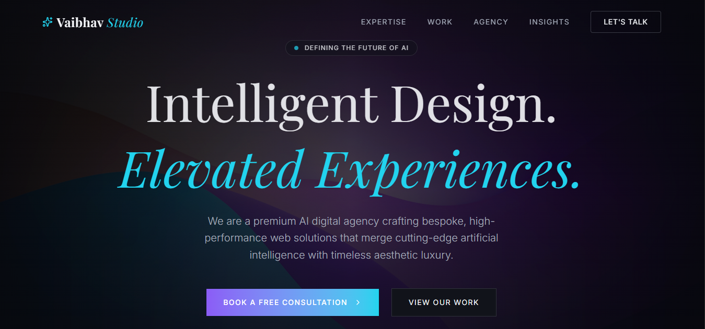
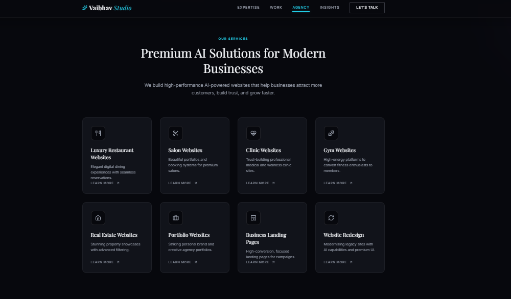
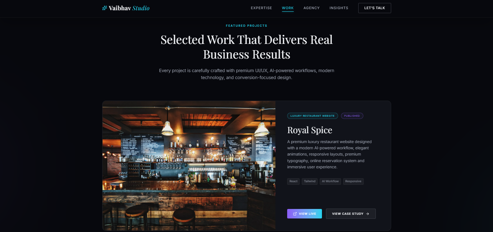
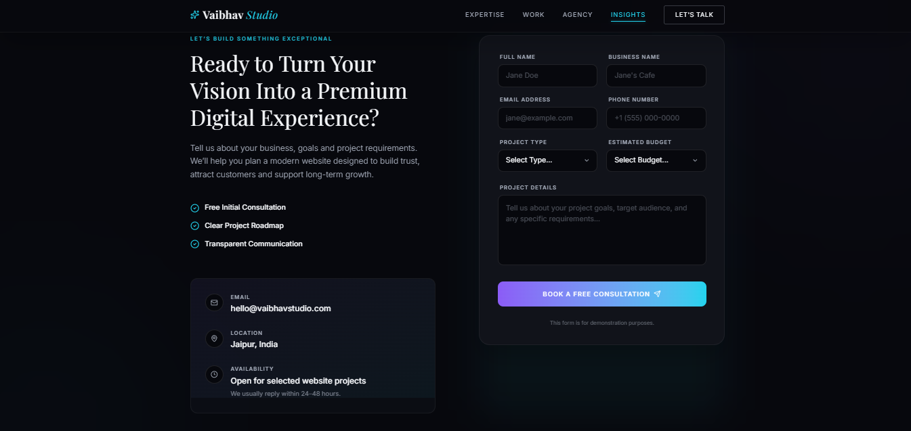
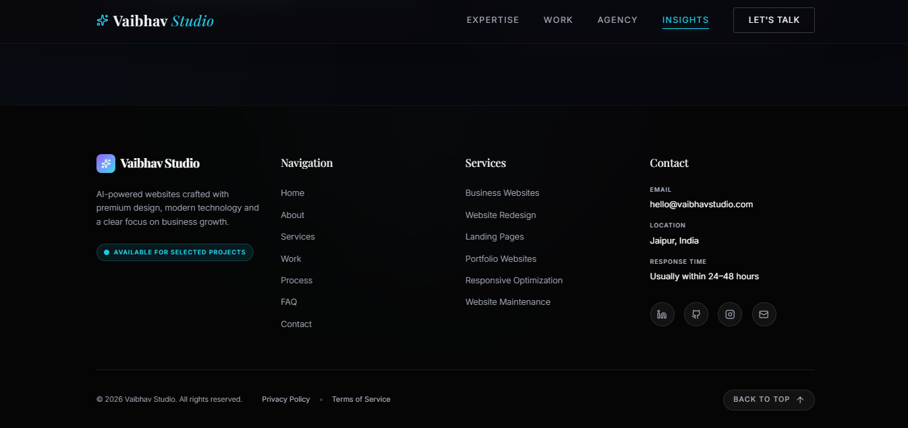
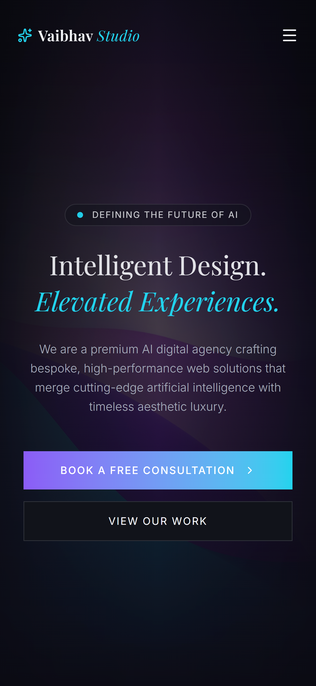
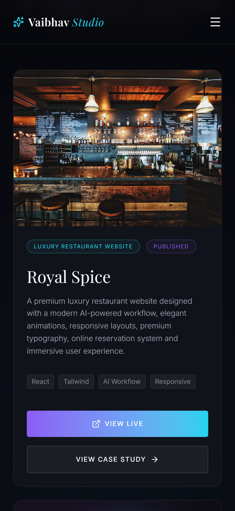

<div align="center">

# ✨ Vaibhav Studio

### Premium AI-Powered Web Design & Development Portfolio

Designing modern, responsive and high-converting digital experiences for ambitious businesses.

🌐 **Live Website**

https://vaibhav-studio.ai.studio

---


</div>

---

# 🚀 About The Project

Vaibhav Studio is a premium AI-powered portfolio website built to showcase modern web design, business-focused UI/UX, responsive layouts and AI-assisted development workflows.

The project demonstrates how design, branding and performance can work together to create premium digital experiences suitable for modern businesses.

---

# 🌍 Live Website

<p align="center">

<a href="https://vaibhav-studio.ai.studio">
  
</a>

<a href="https://github.com/vaibhavstudio/vaibhav-studio-portfolio">
  
</a>

</p>

---

# ✨ Key Highlights

- 🎨 Premium Modern UI
- 📱 Fully Responsive
- ⚡ Fast Performance
- 🤖 AI-Assisted Development
- 🌍 Business-Focused Design

# 🛠 Tech Stack

<div align="center">
<p align="center">


<p align="center">


</p>

| Category | Technologies |
|-----------|--------------|
| **Frontend** | React • TypeScript • HTML5 • CSS3 |
| **Build Tool** | Vite |
| **Development** | Google AI Studio |
| **Version Control** | Git • GitHub |
| **Deployment** | Google AI Studio |

</div>

---

# ✨ Core Features

| Feature | Description |
|----------|-------------|
| 🎨 Premium UI | Modern luxury-inspired interface |
| 📱 Responsive | Optimized for Desktop, Tablet & Mobile |
| ⚡ Performance | Fast loading and optimized layout |
| 🤖 AI Workflow | Built using AI-assisted development |
| 🎯 Conversion Focus | Designed to maximize customer enquiries |
| 🌍 Business Ready | Suitable for real-world business deployment |
| 🎭 Premium Branding | Consistent visual identity across pages |
| 🚀 Scalable | Easy to extend with future projects |

---

# 🖼 Website Showcase

## 🖥 Desktop Experience

### Hero



---

### Services



---

### Featured Project



---

### Contact



---

### Footer



---

## 📱 Mobile Experience

<p align="center">



<br><br>



</p>

---

# 👨‍💻 Author

## Vaibhav Studio

Premium AI-powered web design & development studio helping businesses build modern, responsive and conversion-focused digital experiences using AI-assisted workflows.

### 🌐 Connect

- 🌍 **Live Website:** https://vaibhav-studio.ai.studio
- 💻 **GitHub:** https://github.com/vaibhavstudio/vaibhav-studio-portfolio
- 📧 **Email**: hello@vaibhavstudio.com

---
## 🗺️ Roadmap

- ✅ Premium Portfolio Website
- ✅ Responsive Design
- ✅ AI-powered Development Workflow
- ✅ GitHub Repository
- 🔄 Case Studies
- 🔄 Client Testimonials
- 🔄 Blog & Insights
- 🔄 Premium Business Templates
- 🔄 SEO Optimization
- 🔄 Performance Improvements

---
## ⚙️ Run Locally

```bash
npm install
npm run dev
```

> Requires Node.js 18+ installed.
---

<div align="center">

Made with ❤️ by **Vaibhav Studio**

Premium AI-Powered Web Design & Development Studio

</div>